# SelfSchedule 智能任务管家

一款基于 AI 驱动的个人效率管理 Web 应用，支持任务管理、专注计时、AI 智能任务解析、数据统计等功能。

**在线演示：** https://cjlkybsa.top

## 功能特性

- **任务管理**：创建、编辑、归档任务，支持子任务拆分、优先级标记、分类标签、重复任务自动生成
- **专注计时**：番茄钟式专注模式，支持关联任务、专注评分、中断记录
- **AI 智能解析**：输入自然语言描述，AI 自动解析为结构化任务（含优先级、截止时间、提醒规则）
- **数据统计**：专注时长趋势图、分类统计、打卡日历、成就勋章系统
- **提醒通知**：基于 SSE 实时推送的任务提醒，支持企业微信机器人 Webhook 推送（免费，无需企业管理员权限，个人即可配置）
- **用户体系**：注册登录、邮箱验证码、密码找回、账号封禁与申诉
- **管理后台**：用户管理、反馈处理、申诉审核、在线用户监控、群发消息
- **多端适配**：Web 端 + 微信小程序端（web-view 方案），响应式布局

## 技术栈

### 后端
- **框架**：Spring Boot 3.1 + Java 17
- **ORM**：MyBatis-Plus
- **安全**：Spring Security + JWT 认证
- **缓存**：Redis
- **数据库**：MySQL 8
- **其他**：SSE 实时推送、邮件服务、定时任务

### 前端
- **框架**：Vue 3 + TypeScript
- **UI**：自定义设计系统 + Element Plus
- **图表**：Chart.js
- **构建**：Vite + PWA 插件
- **小程序**：微信小程序 web-view

### 部署
- **服务器**：Ubuntu 24.04 + Nginx (HTTPS)
- **服务管理**：Systemd
- **前端构建产物打包进 Spring Boot JAR，单文件部署**

## 项目结构

```
├── self_schedule/                  # 后端 (Spring Boot)
│   ├── src/main/java/com/cjl/self_schedule/
│   │   ├── auth/                   # 认证模块（登录/注册/用户管理）
│   │   ├── task/                   # 任务管理模块
│   │   ├── focus/                  # 专注记录模块
│   │   ├── reminder/               # 提醒管理模块
│   │   ├── ai/                     # AI 任务解析模块
│   │   ├── admin/                  # 管理后台模块
│   │   ├── appeal/                 # 申诉模块
│   │   ├── feedback/               # 反馈模块
│   │   ├── message/                # 消息模块
│   │   └── common/                 # 公共配置（拦截器/过滤器/异常处理）
│   └── src/main/resources/
│       ├── application.yml         # 主配置文件
│       ├── mapper/                 # MyBatis XML 映射
│       └── static/                 # 前端构建产物（自动打包）
│
├── project-self-schedule-vue-ts/   # 前端 (Vue 3 + TypeScript)
│   ├── src/
│   │   ├── views/                  # 页面组件
│   │   ├── components/             # 公共组件
│   │   ├── composables/            # 组合式函数
│   │   ├── store/                  # Vuex 状态管理
│   │   ├── api/                    # 接口封装
│   │   └── router/                 # 路由配置
│   └── vite.config.ts
│
├── projects/                       # 微信小程序端
├── deploy/                         # 部署脚本
└── self_schedule.sql               # 数据库初始化脚本
```

## 快速启动

### 环境要求
- JDK 17+
- MySQL 8.0+
- Redis
- Node.js 18+

### 后端启动
```bash
cd self_schedule
# 配置环境变量
export DB_USERNAME=root
export DB_PASSWORD=your_password
export JWT_SECRET_KEY=your_jwt_secret_key_at_least_32_chars
export AES_SECRET_KEY=your_aes_secret_key_16_chars

# 导入数据库
mysql -u root -p self_schedule < sql/schema.sql

# 启动
mvn spring-boot:run
```

### 前端开发
```bash
cd project-self-schedule-vue-ts
npm install
npm run dev
```

### 生产部署
```bash
# 构建前端（自动输出到后端 static 目录）
cd project-self-schedule-vue-ts && npm run build

# 打包后端 JAR
cd ../self_schedule && mvn clean package -DskipTests

# 上传到服务器并启动
scp target/self_schedule-0.0.1-SNAPSHOT.jar root@your-server:/opt/self-schedule/
# 参考 deploy/self-schedule.service 配置 Systemd 服务
```

## API 接口

共 81 个 RESTful API，覆盖：认证管理、用户管理、任务管理、子任务、专注记录、消息通知、提醒系统、反馈系统、申诉系统、管理员后台、AI 任务解析、SSE 实时推送。

详见 [后端API接口文档.md](后端API接口文档.md)

## 通知系统

本项目实现了多通道通知体系，确保任务提醒不遗漏：

```
任务到期/提醒时间触发
       │
       ├─→ SSE 实时推送 → Web端弹窗通知（无需刷新页面）
       │
       ├─→ 系统消息 → 站内消息中心（支持已读/未读状态）
       │
       └─→ 企业微信机器人 → 手机/电脑企业微信推送
```

### 企业微信机器人推送

基于企业微信「群机器人」Webhook 实现，**零成本、个人即可配置**：

- 用户在个人设置页填写 Webhook URL，系统自动 AES 加密存储
- 任务提醒触发时自动推送格式化消息到企业微信群
- 内置重试机制（最多 2 次）和限流保护（429 状态码自动退避）
- 支持全局 Webhook 和个人 Webhook 两级配置

配置方法：企业微信群 → 右键添加机器人 → 复制 Webhook URL → 粘贴到应用设置页

## 截图

### 认证页面
| 登录页 | 注册页 |
|:---:|:---:|
| 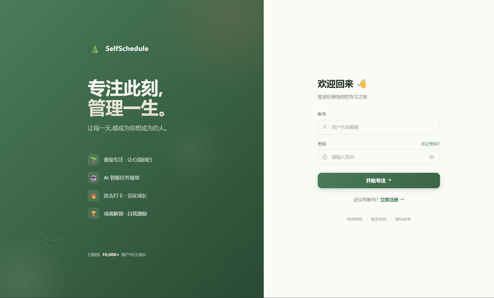 | 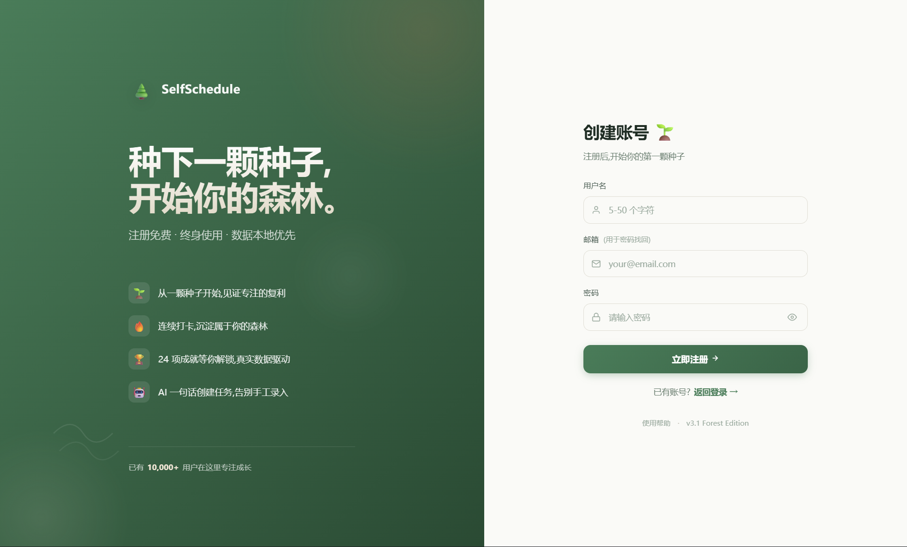 |

### 首页与任务管理
| 首页 Dashboard | 任务管理 |
|:---:|:---:|
| 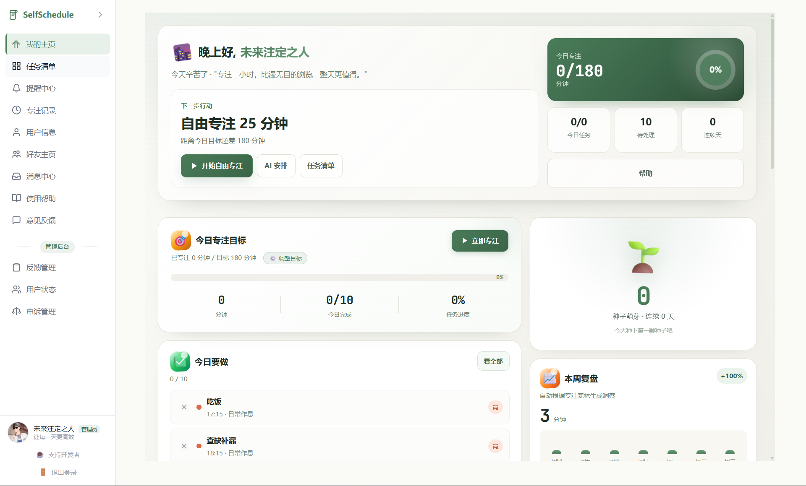 | 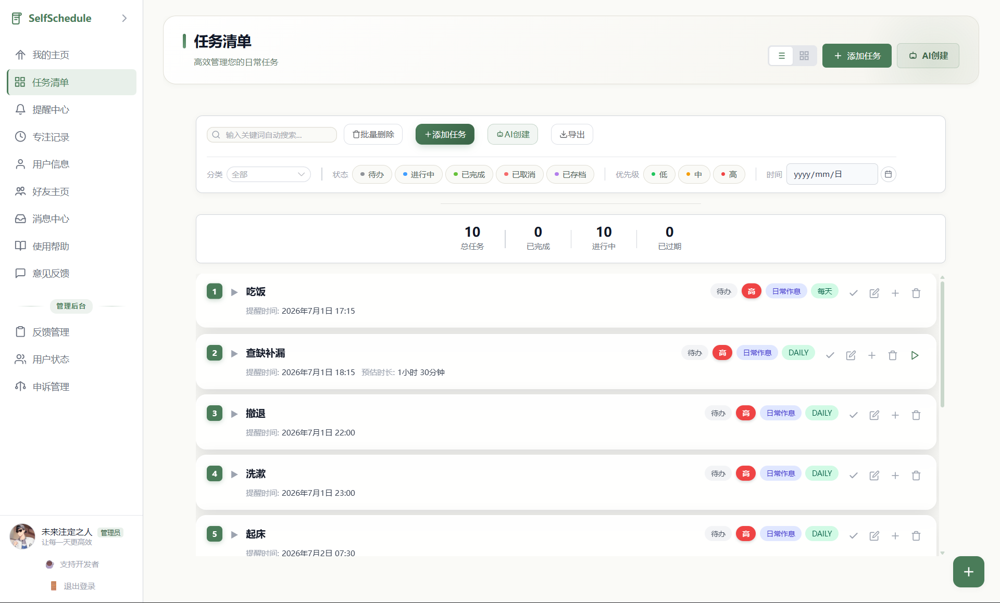 |

### 专注与提醒
| 专注计时 | 提醒管理 |
|:---:|:---:|
| 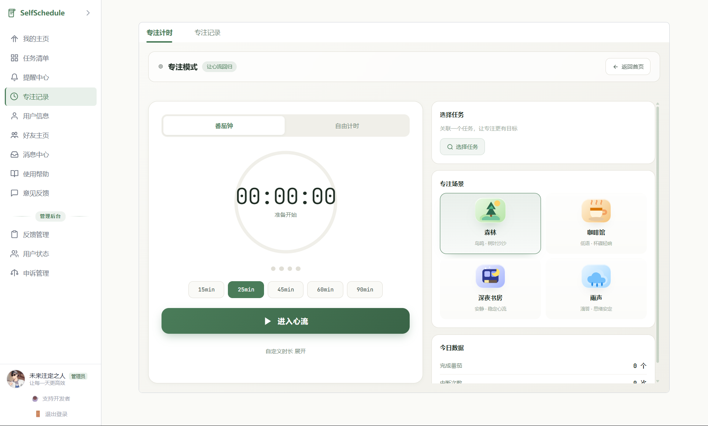 | 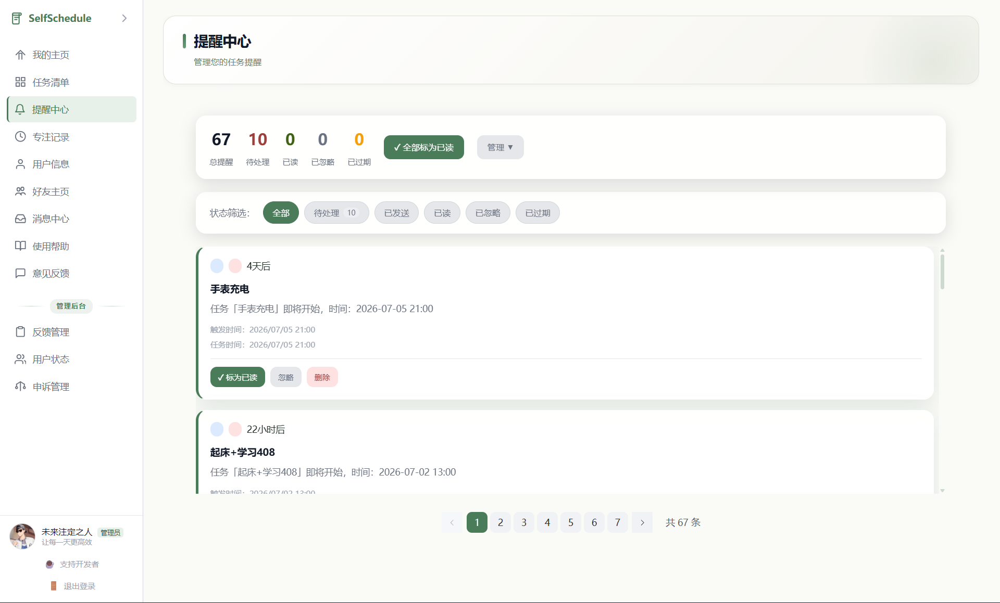 |

### 个人中心
| 用户中心 |
|:---:|
| 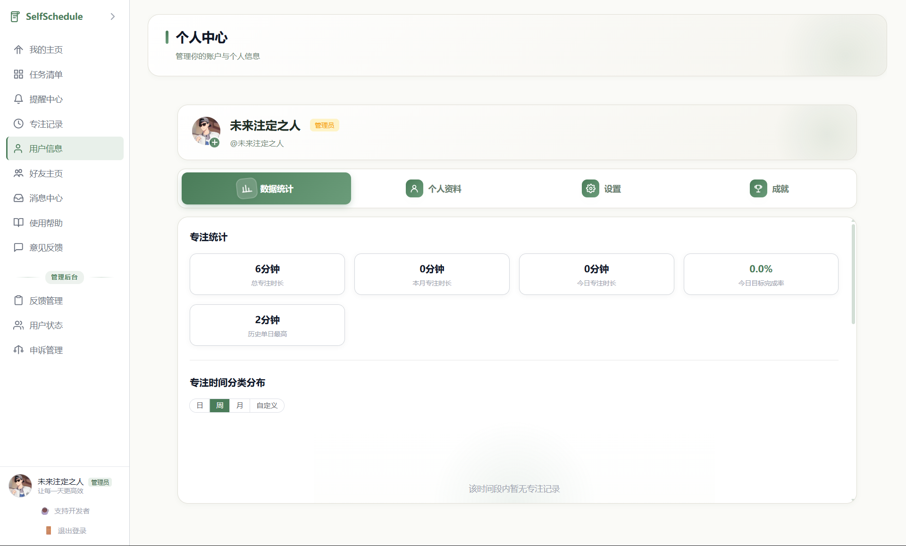 |

### 社交功能
| 好友 | 消息中心 |
|:---:|:---:|
| 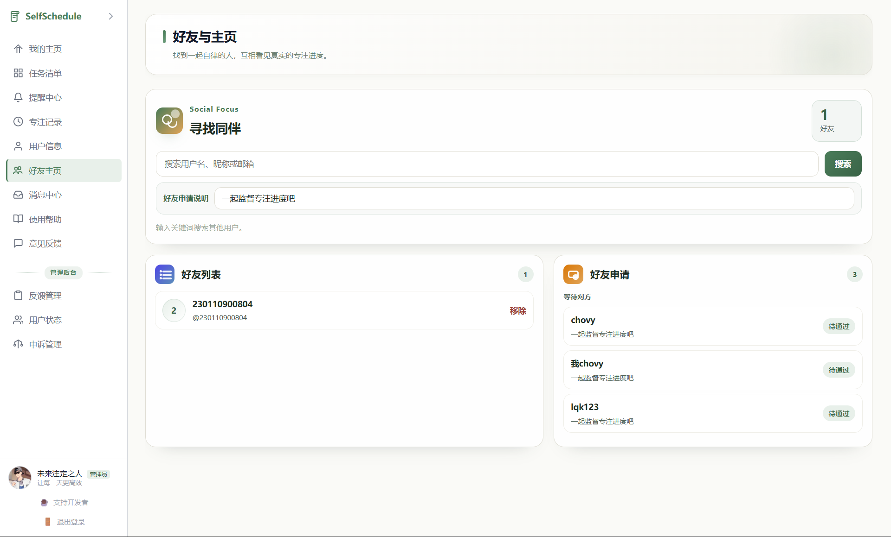 | 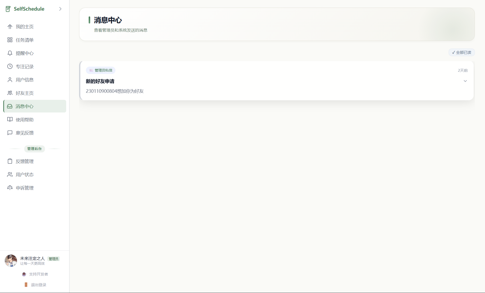 |

### 帮助与反馈
| 帮助中心 | 反馈建议 |
|:---:|:---:|
| 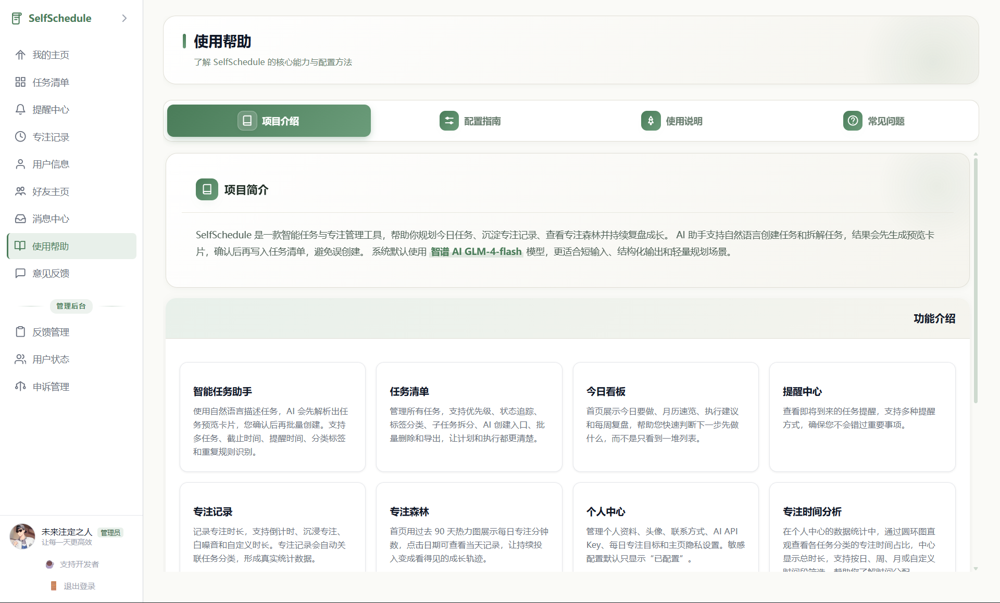 | 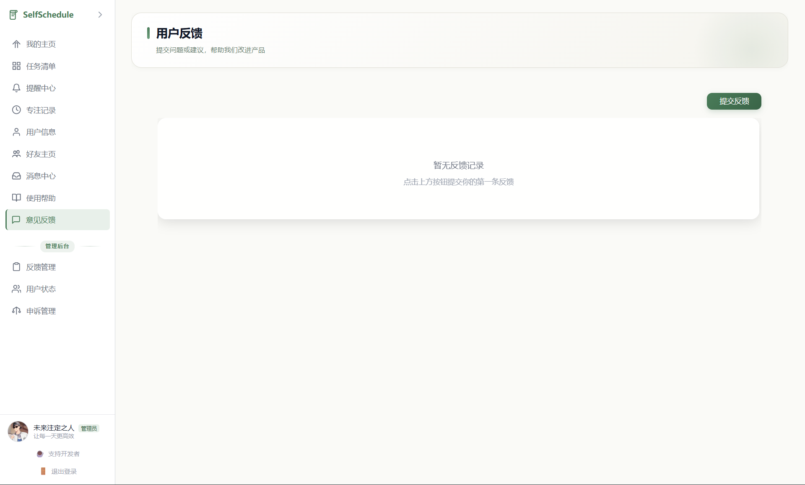 |

## License

MIT
